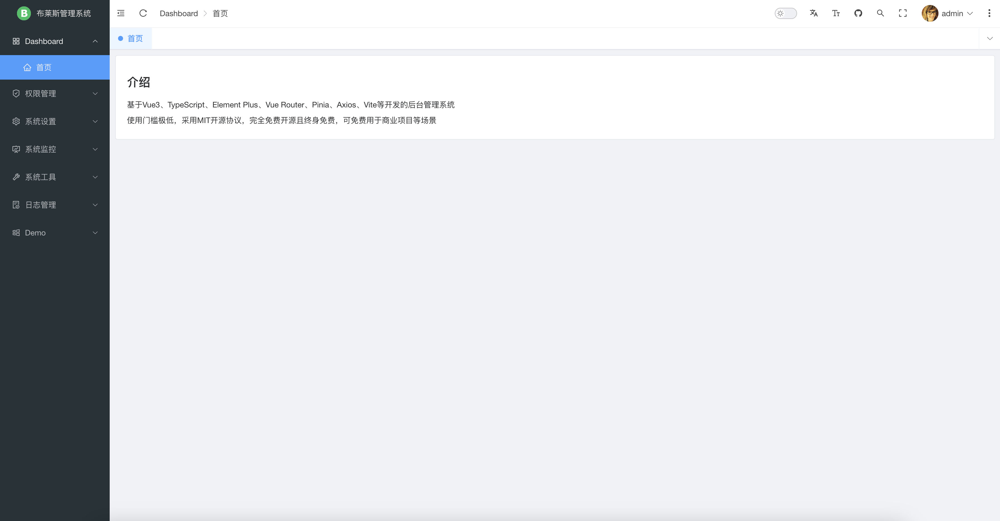
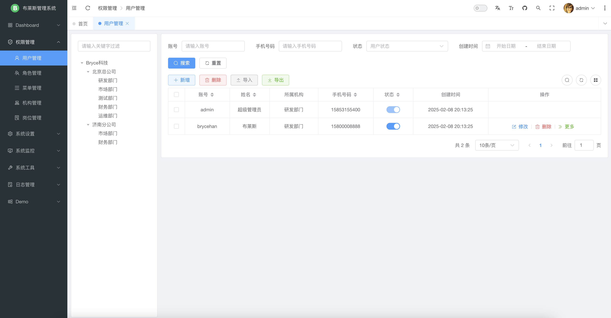
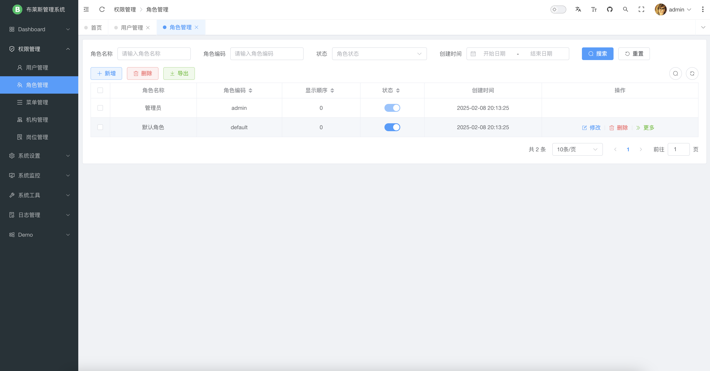
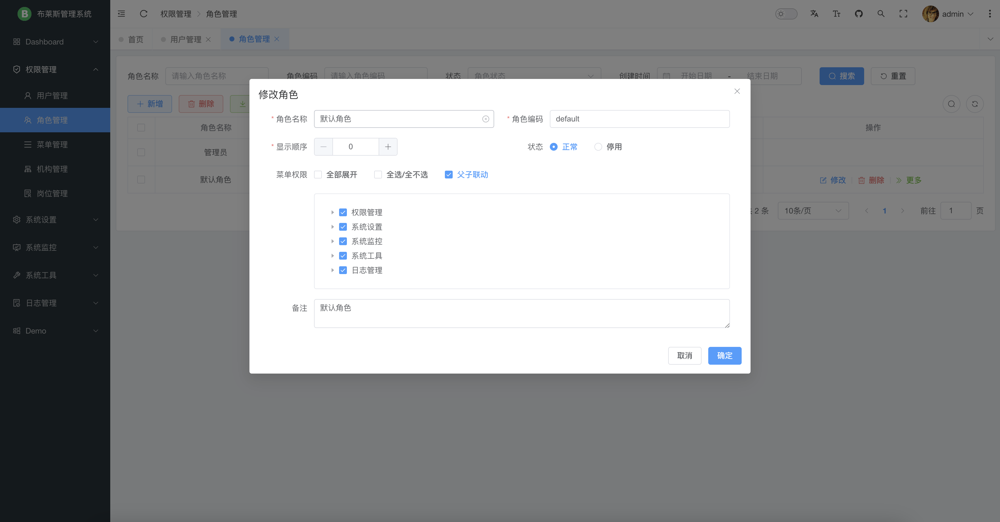
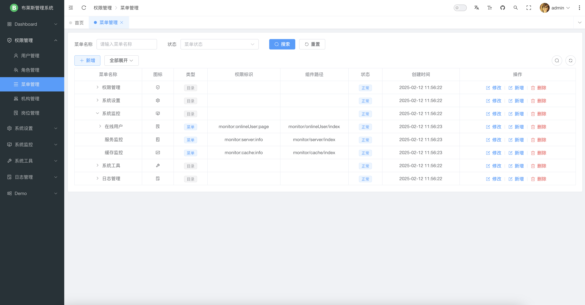
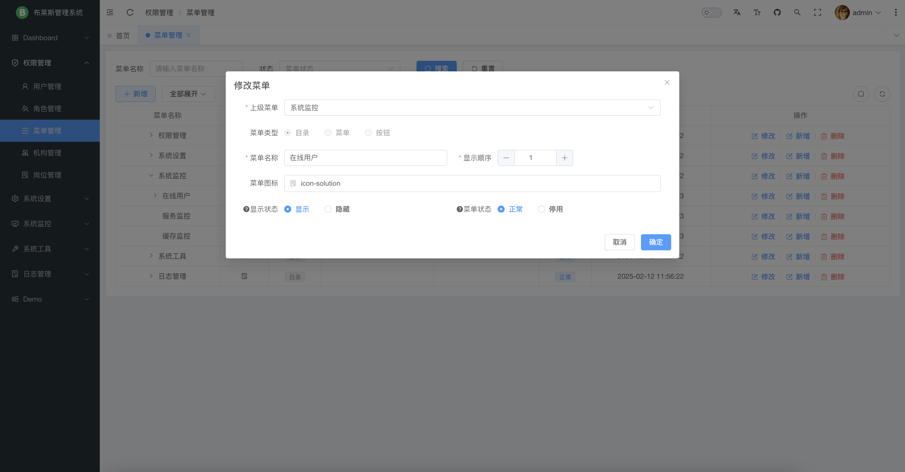
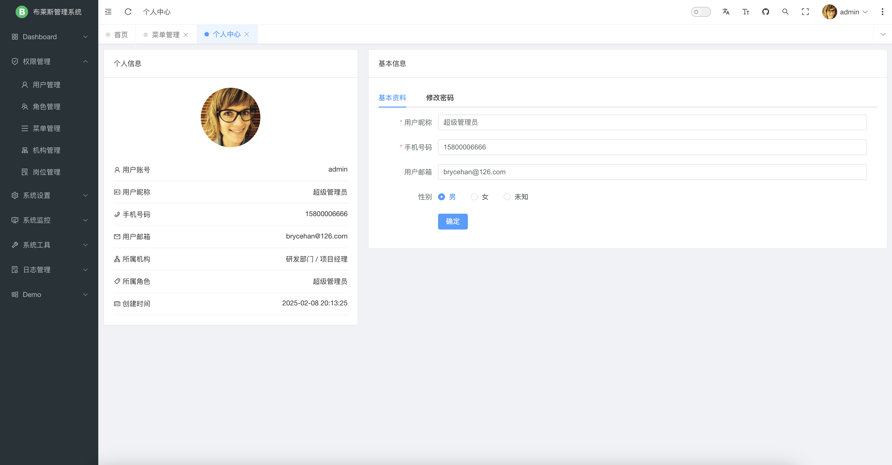
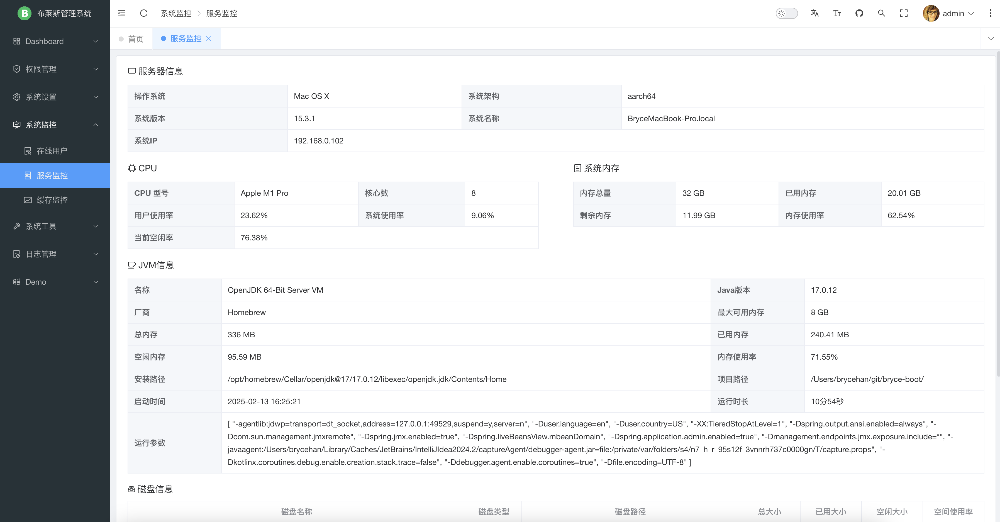
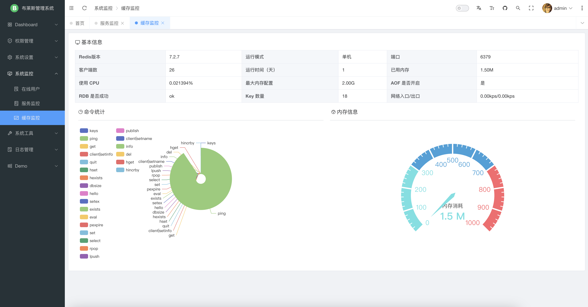
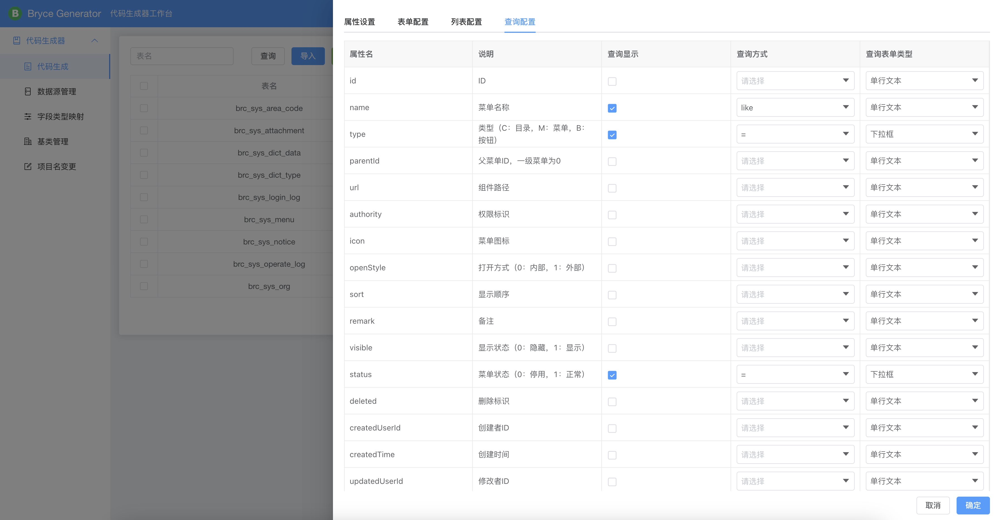

## Bryce Boot

本项目是一个基于 Vue/Element Plus 和 Spring Boot 前后端分离的架构。

* 前端工程：[https://github.com/brycehan/bryce-admin](https://github.com/brycehan/bryce-admin)
* 开发平台后端工程（单体版）：[https://github.com/brycehan/bryce-boot](https://github.com/brycehan/bryce-boot)
* 开发平台后端工程（微服务）：[https://github.com/brycehan/bryce-cloud](https://github.com/brycehan/bryce-cloud)
* 超好用的代码生成器：[https://github.com/brycehan/bryce-generator](https://github.com/brycehan/bryce-generator)

## 平台简介

布莱斯是一套全部开源的快速开发平台，毫无保留给个人及企业免费使用。

* 采用前后端分离的模式，前端技术栈（[Vue3](https://v3.cn.vuejs.org) [Element Plus](https://element-plus.org/zh-CN) [Vite](https://cn.vitejs.dev)）。
* 后端采用Spring Boot、Spring Security、Redis &Jwt。
* 权限认证使用Jwt，支持多终端认证系统。
* 支持加载动态权限菜单，多方式轻松权限控制。
* 高效率开发，使用代码生成器可以一键生成前后端代码。
* 微服务版本，请移步[bryce-cloud](https://github.com/brycehan/bryce-cloud)。

## 系统模块

~~~
bryce-boot
├── bryce-boot-api          // 接口模块
├── bryce-boot-common       // 通用模块
├── bryce-boot-framework    // 框架模块
├── bryce-boot-module       // 业务模块
│       └── bryce-module-email                        // 邮件模块
│       └── bryce-module-monitor                      // 监控模块
│       └── bryce-module-quartz                       // 任务调度模块
│       └── bryce-module-sms                          // 短信模块
├── bryce-boot-server       // 服务模块 [8090]
├── bryce-boot-system       // 系统模块
├── db                      // 数据库脚本
│       └── dm8                                       // 达梦数据库
│       └── mysql                                     // MySQL数据库
│       └── postgresql                                // PG数据库
├── docker                  // 容器模块
├── docs                    // 文档
├── images                  // 图片
├── pom.xml                 // 公共依赖
~~~

## 内置功能

1.  用户管理：用户是系统操作者，该功能主要完成系统用户配置。
2.  机构管理：配置系统组织机构（公司、部门、小组），树结构展现支持数据权限。
3.  岗位管理：配置系统用户所属担任职务。
4.  菜单管理：配置系统菜单，操作权限，按钮权限标识等。
5.  角色管理：角色菜单权限分配、设置角色按机构进行数据范围权限划分。
6.  字典管理：对系统中经常使用的一些较为固定的数据进行维护。
7.  参数管理：对系统动态配置常用参数。
8.  通知公告：系统通知公告信息发布维护。
9.  操作日志：系统正常操作日志记录和查询；系统异常信息日志记录和查询。
10.  登录日志：系统登录日志记录查询包含登录异常。
11.  在线用户：当前系统中活跃用户状态监控。
12.  定时任务：在线（添加、修改、删除)任务调度包含执行结果日志。
13.  代码生成：前后端代码的生成（java、html、xml、sql）支持CRUD下载 。
14.  系统接口：根据业务代码自动生成相关的api接口文档。
15.  服务监控：监视当前系统CPU、内存、磁盘、堆栈等相关信息。
16.  缓存监控：对系统的缓存信息查询，命令统计等。

## 演示图

|     |       |
|-----------------------------------|-------------------------------------|
|   |     |
|   |     |
|   |     |
|   |    |
|  |  |
|  |  |
|  |    |

